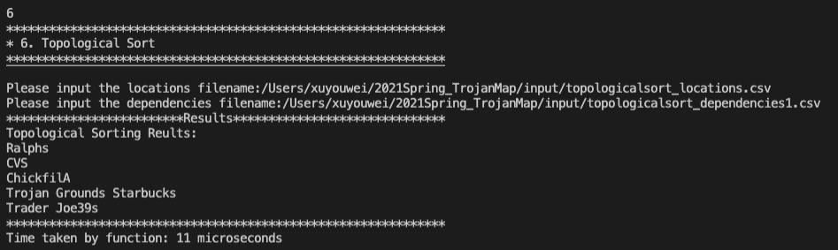

=========================EE599 C++ Project README================================
========================Name: Dongyu Ge, Youwei Xu================================

## Our README file includes the following sections:

```shell
I. High-level overview of our design 
II. Detailed description of each function and its time complexity.
III. Time spent for each function.
IV. Discussion, conclusion, and lessons learned.
```


## I. High-level overview of our design 

<p align="center"></p>

Each point on the map is represented by the class **Node** shown below and defined in [trojanmap.h](src/lib/trojanmap.h). These nodes are stored in the parameter 'data' in the container of 'map'.

```cpp
class Node {
  public:
    std::string id;    // A unique id assign to each point
    double lat;        // Latitude
    double lon;        // Longitude
    std::string name;  // Name of the location. E.g. "Bank of America".
    std::vector<std::string>
        neighbors;  // List of the ids of all neighbor points.
};

```
This project builds a USC surroundings map application with using data structures in C++ and implementing various graph algorithms. The application has the following seven functionalities:

```shell
**************************************************************
* Select the function you want to execute.
* 1. Autocomplete
* 2. Find the position
* 3. CalculateShortestPath
* 4. Travelling salesman problem
* 5. Cycle Detection
* 6. Topological Sort
* 7. Exit
**************************************************************
```

When the user chooses the number from 1 to 7, the application codes will excuate the corresponding the function and help users to make further desicions.


## II. Detailed description of each function and its time complexity

1.STEP1: Autocomplete

```shell
* input: a patial location name; output: a vector of full name
* turn each character of input name into the lower case
* traverse all nodes in 'data' map and turn each character of node name into the lower case
* compare the input name with the node names each time
* if find the input name is the prefix of some node names, return the node names
* if the input name does not correspond to any node name, return an empty vector

* Time complexity: O(n)
```


2.STEP2: Find the position

```shell
* input: a location name; output: pair<double lat, double lon>
* traverse all nodes in 'data' map
* if find a name is the same as the input name, return the location name's lat and lon
* if the location name does not exist in the 'data' map, return (-1,-1)

* Time complexity: O(n)
```

3.STEP3: CalculateShortestPath

We employ two methods, Dijkstra and Bellman Frod Algorithm to implement shortest path. 

```shell
Dijkstra:
* input: 2 locations, one is start point and the other is destination; output: the shortest path which is a list of id
* put all nodes' id into 'allNodes' vector
* create a 2237×2237 matrix 'weight', and the value of each blank represents distance between a pair of nodes. If one node is not the neighbour of the other node, we set the distance infinity.
* Get start and end node from point’s name;
* Then implement the algorithm same as what is told in the lecture.


* Time complexity: O(n^2)

Bellman Ford:
* input: 2 locations, one is start point and the other is destination; output: the shortest path which is a list of id
* Also put all nodes'id into 'allNodes' vector and create a matrix to record the distance between two nodes.
* Implementation of the algorithm is the same as lecture.

* Time complexity: O(n*m)
```

4.STEP4: Travelling salesman problem
```shell
* We finish this problem using three methods. In all the three methods we will
* use function Permute_aux to find all the possible route.


* Brute force method:
* Just Traverse all the possible paths and find the minimum one.
* 
* Time complexity: O(m+n+k)

*2-opt method:
* First we initial a path as the minimum path.
* Second we randomly exchange two nodes and compare with the intial path. If we exchange 5 times and the initial path
* is still the minimum path. We think we get the good result.
* If minimum path is changed during the exchange we will initial a new path as the minimum path and repeate the step 1 and 2. 
* We use swap_2Cal function to exchange two nodes.

void TrojanMap::swap_2Cal(std::vector<std::string> &init_path,int &counter,double &min_len,
std::vector<std::vector<std::string>> &results){
  results.push_back(init_path);
  for(int m=1;m<init_path.size()-2;m++)
  {
    for(int n=m+1;n<init_path.size()-1;n++){
      
        std::vector<std::string> swap_path=init_path;
        std::string temp_node=init_path[m];
        swap_path[m]=swap_path[n];
        swap_path[n]=temp_node;
        double temp_route=0;
        for(int j=0;j<swap_path.size()-1;j++)
        {
          temp_route += CalculateDistance(data[swap_path[j]],data[swap_path[j+1]]);
        }
        if(temp_route<min_len)
        {
          counter=0;
          min_len=temp_route;
          init_path=swap_path;
          return;
        }
        else{
          counter++;
        }
        if(counter==5)
          return;

    }
  }
  
}


* Time complexity: O(m+n+k)

*3-opt method:
It is similar with 2-opt. Instead of exchange 2 nodes we exchange three nodes at a time and do the same process of 2-opt.
*we use swap_3Cal function to do the process of exchanging three nodes. use TravellingTrojan_3opt to complete the 3-opt algorothm. 
* In the TravellingTrojan_3opt funciton we will call the swap_3Cal function if we change 5 times and the path is still the minimum
* we think we get the optimal result.

void TrojanMap::swap_3Cal(std::vector<std::string> &init_path,int &counter,double &min_len,
std::vector<std::vector<std::string>> &results){
            results.push_back(init_path);
            for(int m=1;m<init_path.size()-3;m++)
            {
              for(int n=m+1;n<init_path.size()-2;n++)
              {
                for(int p=n+1;p<init_path.size()-1;p++)
                {
                    std::vector<std::string> swap1_path=init_path;
                    std::string node_m=swap1_path[m];
                    std::string node_n=swap1_path[n];
                    std::string node_p=swap1_path[p];
                    swap1_path[n]=node_m;
                    swap1_path[p]=node_n;
                    swap1_path[m]=node_p;
                    double temp_route=0;
                    for(int j=0;j<swap1_path.size()-1;j++)
                      {
                          temp_route += CalculateDistance(data[swap1_path[j]],data[swap1_path[j+1]]);
                      }
                    
                    if(temp_route>min_len)
                    {
                      counter++;
                      if(counter==5)
                          return;
                      
                    }
                    else{
                      min_len=temp_route;
                      counter=0;
                      init_path=swap1_path;
                      return;
                    }
                    swap1_path=init_path;
                     node_m=swap1_path[m];
                     node_n=swap1_path[n];
                     node_p=swap1_path[p];
                    swap1_path[m]=node_n;
                    swap1_path[n]=node_p;
                    swap1_path[p]=node_m;
                    temp_route=0;
                    for(int j=0;j<swap1_path.size()-1;j++)
                      {
                          temp_route += CalculateDistance(data[swap1_path[j]],data[swap1_path[j+1]]);
                      }
                    
                    if(temp_route>min_len)
                    {
                      counter++;
                      if(counter==5)
                          return;
                      
                    }
                    else{
                      min_len=temp_route;
                      counter=0;
                      init_path=swap1_path;
                      return;
                    }
                }
              }
            }
}

```

5.STEP5: Cycle Detection

In this section, we use two functions to complete cycle detection.

```cpp 
bool TrojanMap::CycleDetection(std::vector<double> &square) 
```
```shell
* input: four points of the square-shape subgraph; output: return true if there is a cycle path inside the square, false otherwise
* create a map 'isvisited' and another map 'father' to record the predecessor of a node
* traverse all nodes on the map
* If the node’ position is in the square and the node didn’t visited, go to the 'IsCyclicUttil' function
* If 'IsCyclicUttil' function return true, the whole function return true
```

```cpp
bool TrojanMap::IsCyclicUttil(std::string node_id, std::map<std::string,int> &isvisit,std::string parent_id,
const std::vector<double> &square,std::map<std::string,std::string> &father)
```
```shell
* mark current node as true in 'isvisited' map and record the father node of it 
* traverse current node’s neighbor nodes and record current node as father node of these neighbor nodes
* If the neighbor is in area and it visited and it’s not the parent node(i.e. two nodes don’t construct a cycle), that means there exists a cycle => return true
* use the 'father' map to plot the cycle
* If the neighbor is in area and it unvisited, recursively do 'IsCyclicTttil' functiom. If the final recursive one return true, then means has cycle => return true
* otherwise, that means no cycle => return false

* Time complexity:O(n^2)
```


6.STEP6: Topological Sort

We employ two methods.

```shell
method 1:
* input: a vector of location names ; output: nodes after topological sorting
* use DFS to find the valid route. 
* We use topo function to do the process of toplogical sort.
void TrojanMap::topo(std::string root,std::map<std::string,int> &marks,std::vector<std::string> &top_list, std::map<std::string,std::vector<std::string>> &edge_map){
   marks[root]=1;
   std::vector<std::string> temp=edge_map[root];
   for(const std::string &child : temp)
   {
       if(marks[child]!=1)
       {
         topo(child,marks,top_list,edge_map);
       }
   }
   top_list.push_back(root);

 }
 
* In the function std::vector<std::string> TrojanMap::DeliveringTrojan(std::vector<std::string> &locations,
                                                      std::vector<std::vector<std::string>> &dependencies) we will call the topo function.
 
* Time complexity:O(m+n)
```

```shell
method 2:
* input: a vector of location names ; output: nodes after topological sorting
* traverse nodes and each time find if the node depends on other nodes（i.e. if it appears at the second position of each elements in 'dependencies' vector)
* if the node cannot depend on other node, then put it into the 'result' vector.
* otherwise, keep traversing nodes in 'location' vector until all nodes have been put into the result
* if there exist no topological sort, return an empty 'result' vector

* the size of 'data'= n and the size of 'dependency'= m
Time complexity: O(mn)
```


## III. Time spent for each function
We give a specific example and show the corresponding time spent by function below here.


1.STEP1: Autocomplete

<p align="center"></p>
<p align="center"></p>
<p align="center"></p>


2.STEP2: Find the position

<p align="center"></p>

3.STEP3: CalculateShortestPath   

<p align="center"></p>
<table>
   <tr>
       <td><p align="left"></p></td>
       <td><p align="right"></p></td>
   </tr></table>

Dijkstra is much more faster than Bellman-Ford method.

4.STEP4: Travelling salesman problem

<p align="center"></p>

2-opt heuristic method gets the same result with the Brute force method. 3-opt heuristic method doesn't get the optimal result and the difference is 0.2. However, 2-opt heuristic and 3-opt heuristic are much more faster than the Brute force method.

5.STEP5: Cycle Detection

<p align="center"></p>

6.STEP6: Topological Sort

<p align="center"></p>


## IV. Discussion, conclusion, and lessons learned

We worked together to finish this C++ project finally. Not only has our programming ability improved further, but our understanding of algorithms, such as DFS, Bellman Ford and DAG, has also deepened. Since the thoughts about how to implememt these functions varies from person to person, the cooperation between us inspires some new thoughts and methods to deal with the same function, which is a motivative and excited process. This is a meaningful course for students who are prepared to become a programmar.
